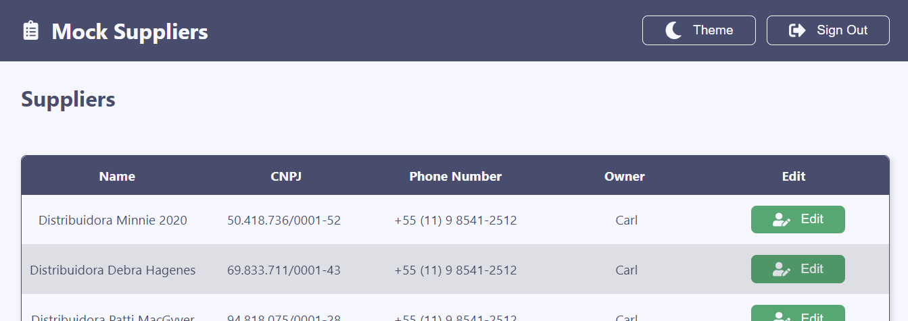

<p align="center">
   
</p>

# Fake Store Cart

#### 📌 About

- Suppliers List - Mock Suppliers list

#### 🛒 Deploy on Vercel

- [Production](https://suppliers-mock-list.vercel.app/)

#### 🧑‍💻 Technologies

- [React JS](https://pt-br.reactjs.org/docs/getting-started.html)
- [Typescript](https://www.typescriptlang.org/docs/)
- [Vite](https://vitejs.dev/guide/#scaffolding-your-first-vite-project)
- [Jest](https://jestjs.io/docs/en/getting-started)

#### ⚙️ Getting Started

First, run the development server:

```bash
yarn dev
```

Open [http://localhost:3000](http://localhost:3000) with your browser to see the result.

#### 📋 Tests

For run jest tests:

```bash
yarn test
```

<!-- #### 📱 Preview Responsive

<p align="center">
<video src='/' width=180/>
</p>

#### 💻 Preview PC

<p align="center">
<video src='/' width=180/>
</p> -->
